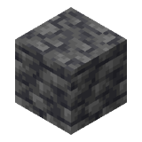
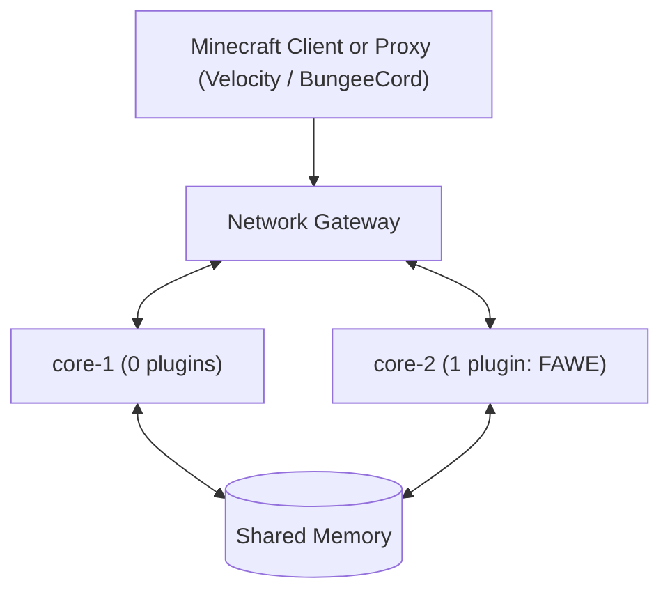

  
  <h1 align="center" style="margin-top: 10px;">Deepslate</h1>
  

    <strong>Distributed server architecture for Minecraft focused on vertical scaling.</strong>
  

  

    
    
    
    
    
  

Deepslate is a distributed server architecture designed to address the historical single-threaded bottleneck in Minecraft.

Built on a custom Paper fork (branch `ver/1.21.11`) and a high-performance network gateway, it achieves **vertical scaling** by distributing the simulation of a single continuous world across multiple independent server processes utilizing the CPU cores of a single host, while preserving an uninterrupted and seamless player session.

## Vertical Scaling

Since Minecraft's inception, the core simulation loop (the tick) has run on a single processor thread. Even on modern dedicated machines with 16, 32, or 64 cores, a standard Minecraft server only utilizes one core to simulate a world. As player, entity, or redstone counts grow, this single core saturates, and server performance degrades (TPS drop).

Deepslate adopts a **vertical scaling** approach: unlocking the full processing power of a machine by distributing the simulation workload of a single continuous world across all available CPU cores.

* **Multi-Process Parallelization**: Multiple specialized Paper instances run concurrently, each isolated on dedicated CPU cores.

* **Decoupled Network Offloading**: A dedicated network gateway handles all packet broadcasting and combinatorial fan-out ($O(N^2)$), freeing simulation cores to focus exclusively on game physics and logic.

* **Shared System Memory**: Processes communicate via an ultra-low-latency shared memory layer, ensuring instantaneous cross-process world state synchronization without serialization overhead.

## Comparison: Deepslate vs. Folia

Deepslate should not be confused with regional multi-threading projects like **Folia**:

| Feature | Folia (Regional) | Deepslate (Distributed) |
| :--- | :--- | :--- |
| **Execution Model** | Single-process (1 multi-threaded JVM) | Independent multi-process cluster |
| **Fault Tolerance** | A JVM crash disconnects all players | Transparent failover with zero player kicks |
| **Hotspots (Single Chunk)** | Saturates the single thread assigned to that region | Offloaded network fan-out & multi-node replicas |
| **Plugin Ecosystem** | Symmetric (identical plugins cluster-wide) | Asymmetric (independent per-node plugins) |
| **State Persistence** | Risk of rollbacks on sudden crashes | Persistent shared memory (guaranteed zero rollback) |

## Unlocked Capabilities

Decoupling player connections, the network gateway, and simulation processes unlocks major operational capabilities:

* **Massive Player Capacity on a Single Chunk**:  
  On a standard server (and even on Folia, where a chunk's computation is pinned to a single regional thread), gathering 100 or 200 players in one place collapses the tick rate. This is primarily caused by combinatorial network fan-out ($O(N^2)$: tens of thousands of movement, rotation, and animation packets generated and encrypted per tick). Deepslate offloads all network broadcasting to its gateway, allowing simulation cores to maintain a rock-solid 20.0 TPS even during extreme crowd density.

* **Universal Visibility & Real-Time Cross-Node Interactions**:  
  Even when players are simulated on different backend nodes, they inhabit the exact same visual space without phasing or instancing. Through a synchronized replica system, players see each other, observe real-time movements, head rotations, arm swing animations, and engage in natural combat seamlessly.

* **Zero-Kick Plugin Updates & Live Maintenance**:  
  Each cluster node runs on our Paper fork and can maintain an asymmetric plugin configuration. In this demonstration, Node 1 is completely vanilla (0 plugins), while Node 2 runs FastAsyncWorldEdit (1 plugin). This proves plugins can be loaded, updated, or reloaded node-by-node during live gameplay without shutting down the server or kicking active players.

* **Crash Resilience & Failover with Zero Rollbacks**:  
  If an active node crashes or is intentionally stopped via `/stop`, the network gateway absorbs the socket disconnection and transparently migrates the player session to a healthy node in milliseconds. Because world and player states reside in a shared memory layer independent of individual server lifecycles, players experience **no disconnect screen, no lost progress, and zero rollback**.

* **Full Shared World & Redstone Consistency**:  
  Blocks, inventories, redstone clocks, and scheduled block ticks remain continuously synchronized across nodes. Large-scale terrain modifications affecting thousands of blocks on one node are immediately persistent and intact when transitioning to a vanilla node.

## Technical Demonstration

The demonstration below validates these architectural concepts on a live Deepslate cluster.

### Testbed Topology

### Video Demonstration

The video below validates these architectural concepts on a live Deepslate cluster:

  

### Key Milestones in the Demonstration

* **Continuous Flight Switching (Chaos Mode)**: The player flies through newly generating chunks while an automated stress test triggers **13 consecutive handovers in 60 seconds** between `core-1` and `core-2`. The on-screen HUD displays active node switching in real time without stuttering, rubberbanding, or chunk reloading.

* **Abrupt Node Shutdown Without Disconnection**: The player executes `/stop` on the active node while mid-air. The gateway immediately reroutes traffic to the secondary node without interrupting flight. Once the initial node is restarted, it dynamically rejoins the live cluster.

* **Plugin Asymmetry & Terrain Persistence Verification**:
  * **Node Isolation**: `core-1` runs vanilla with 0 plugins, while `core-2` runs FastAsyncWorldEdit (1 plugin).
  * **Terrain Carving**: On `core-2`, a mountainous area of **4,536 blocks** is deleted using `//set 0`.
  * **Emergency Shutdown**: `core-2` is terminated with `/stop`.
  * **World Persistence**: Migrated to `core-1` (zero plugins), the 4,536-block crater remains 100% persistent and synchronized.

> [!NOTE]
> **100% Vanilla Client**: This demonstration was captured using an unmodified, official Minecraft client. The cluster diagnostic telemetry displayed at the top of the screen is rendered server-side via the player list header (Tablist).

## Project Status

Deepslate is a proprietary research and infrastructure project developed by **PunkRecordz**. The source code is currently private. Further benchmarks, demonstrations, and technical milestones will be released as development progresses.

  © 2026 PunkRecordz. All rights reserved.

